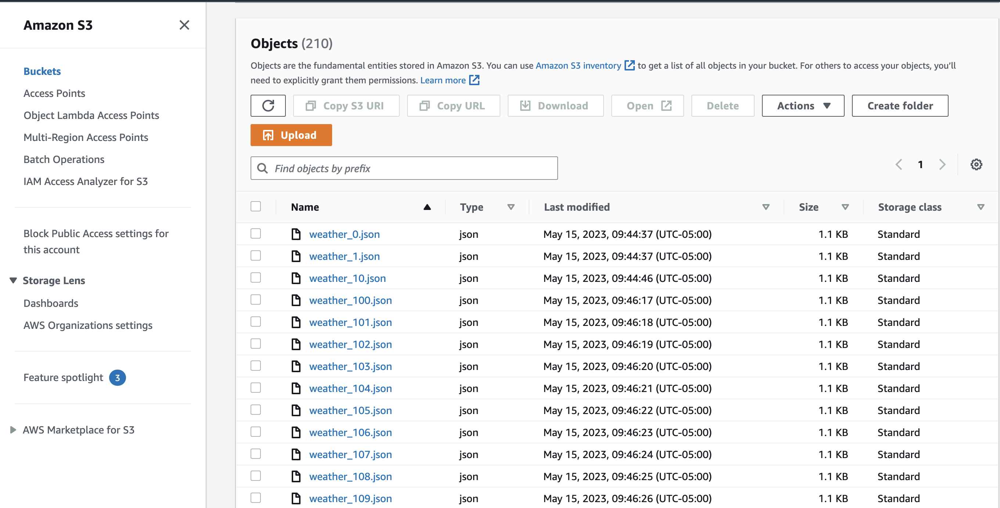
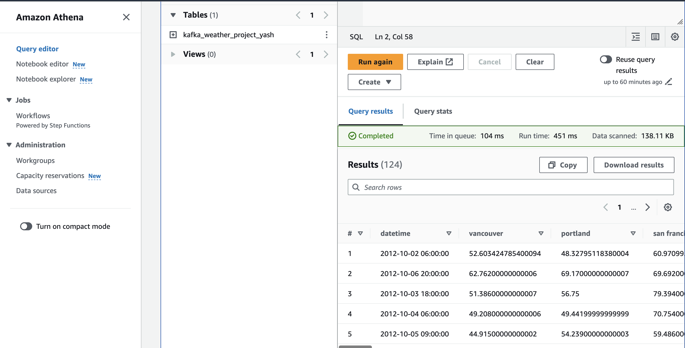

# Weather Data Pipeline Simulation

## Summary
This project was a way for me to understand how to create a data pipleline using Kafka. I utilized a [weather dataset](https://www.kaggle.com/datasets/selfishgene/historical-hourly-weather-data?resource=download) to simulate real time data streaming for this project. First, I cleaned the data with Python and the Pandas library. Then, I created an EC2 instance on AWS to host my Kafka and Zookeeper services. After, I set up KafkaProducer.py to simulate sending real time weather data to my EC2 instance. The KafkaConsumer.py consumes this data and stores it in an AWS S3 bucket. AWS Glue Crawler creates a Glue Catalog which allows for querying of the weather data using AWS Athena.

## CLI commands

### Connecting to EC2 Instance
- cd .ssh (or change directory to wherever the RSA keys are stored for the EC2 instance)
- ssh -i "name_of_RSA_key_file" ec2-user@{your_ec2_public_ip}.{your_ec2_region}.compute.amazonaws.com

### Starting Zookeeper (after connecting to EC2)
- bin/zookeeper-server-start.sh config/zookeeper.properties

### Starting Kafka (after zookeeper starts)
- export KAFKA_HEAP_OPTS="-Xmx256M -Xms128M" (increases memory size for Kafka)
- cd kafka_2.12-3.3.1 (change directory to where ever kafka is on EC2)
- bin/kafka-server-start.sh config/server.properties

## Images of AWS S3 & Athena

